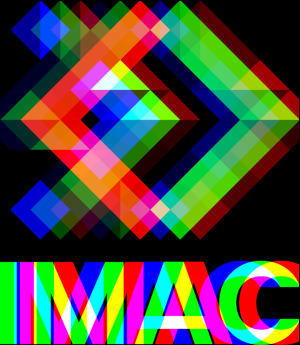
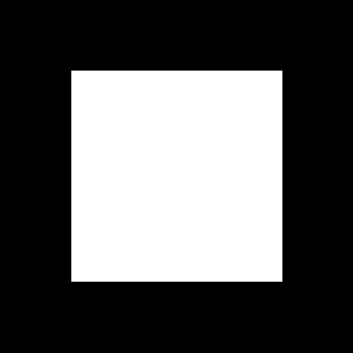
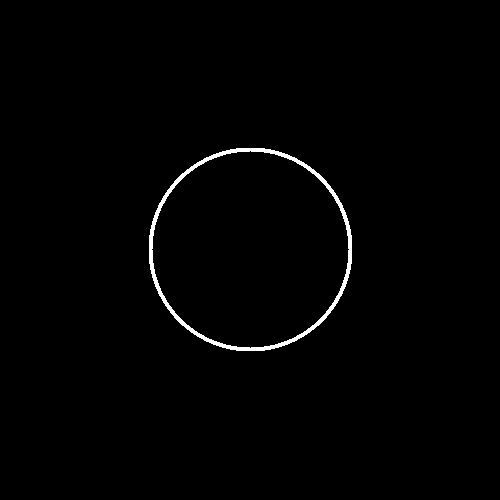
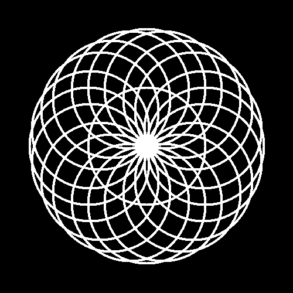
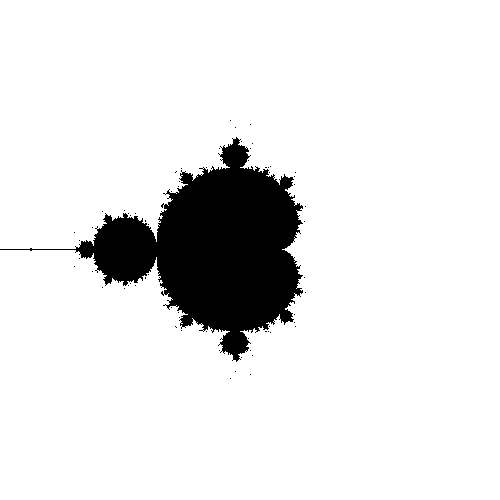
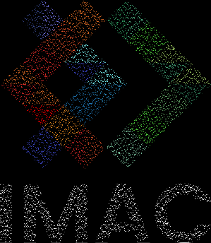
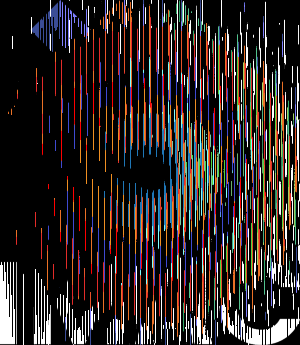

# 🐣 S1 | Prog: Workshop C++ (20/22/2023)
# RAPPORT
## Laurine ALLEMON et Elisabeth WAGNER

---

 
Template de projet pour le workshop de prog des Imac1. Vous trouverez le sujet ici: https://dsmte.github.io/Learn--cpp_programming/Workshop

 
 

 
EXERCICES WORKSHOP

 

## EXERCICE 1  || Ne garder que le vert || ⭐

 
RESULTATS

 

 
COMMENTAIRE 

Ce premier exercice n'était pas dur mais permettait de nous faire comprendre comment agir sur les couleurs rouge, vert, bleu d'un pixel indépendamment les unes des autres.

 
 

---
## EXERCICE 2  || Échanger les canaux || ⭐

 
RESULTATS

 

 
COMMENTAIRE 

Au départ, dans le but d'échanger les couleurs, nous avons fait l'erreur d'assigner le canal bleu au canal rouge puis le canal rouge au canal bleu. Mais nous nous sommes vite rendue compte que cette méthode écrasait le canal bleu. 
Nous avons alors pensé à deux autres façons de penser : 
- utiliser la fonction swap.
- créer une nouvelle variable afin de stocker une des deux couleurs à échanger pour que celle-ci ne soit pas modifiée lors du premier échange.

 

---
## EXERCICE 3  || Noir & Blanc || ⭐

 
RESULTATS

 

 
COMMENTAIRE

 
Pour ce code, chacune de nous n'avez pas immédiatement pensé à faire une moyenne des trois couleurs pour obtenir du gris mais une fois la formule trouvée, le code est simple à réaliser.

 

---
## EXERCICE 4  || Négatif || ⭐

 
RESULTATS

 

 
COMMENTAIRE

 
Comme pour l'exercice précédent, la difficulté est de trouver la formule (1-couleur concernée du pixel), mais le code en lui même est rapide et simple à réaliser.

 

---
## EXERCICE 5  || Dégradé || ⭐

 
RESULTATS

 

 

 
COMMENTAIRE

Pour cet exercice, les couleurs rouge, vert et bleu du pixel sont les mêmes que celles du pixel précédent auquel on ajoute 0.003. Ceci permet d'obtenir un dégradé progressif du noir vers le blanc. Il faut bien penser à agir sur les trois couleurs pour obtenir du blanc et à réutiliser les valeurs du pixel précédent pour obtenir un dégradé progressif.       

 

---
## EXERCICE 6  || Miroir || ⭐⭐

 
RESULTATS

 

 
COMMENTAIRE

 

Nous n'avons pas rencontré de problèmes particuliers pour cet exercice.

---
## EXERCICE 7  || Image bruitée || ⭐⭐

 
RESULTATS

 

 
COMMENTAIRE

Nous n'avons pas rencontré de problèmes particuliers pour cet exercice.

 

---
## EXERCICE 8  || Rotation de 90° || ⭐⭐

 
RESULTATS

 

 
COMMENTAIRE

Nous n'avons pas rencontré de problèmes particuliers pour cet exercice.

 

---
## EXERCICE 9    || RGB split || ⭐⭐

 
RESULTATS

 

 
COMMENTAIRE

Nous avions d'abord sauté cet exercice pour faire les suivants car il nous semblait compliqué. Cependant, nous sommes revenu dessus après avoir fini les exercices de niveau 3 et commencé ceux de niveau 4. Il nous a alors paru très simple et n'avons pas rencontré de difficultés. 
Le seul piège à éviter était l'utilisation de la même image pour faire les modifications.

---
## EXERCICE 10 || Luminosité || ⭐⭐

 
RESULTATS

 

 
COMMENTAIRE

Pour cet exercice, nous n'avons pas tout de suite pensé à utiliser la fonction puissance. Au départ nous avions simplement fait une soustraction/addition sur les couleurs RGB de tous les pixels de l'image. Puis, en regardant les indices fournis nous avons compris l'intérêt d'utiliser cette fonction et le lien vers la représentation visuelle de la courbe nous a permis de déterminer les valeur à utiliser.

---
## EXERCICE 11  || Disque || ⭐⭐

 
RESULTATS

 

 
COMMENTAIRE

Cet exercice n'était pas difficile en soit, il fallait juste réussir à coder la formule de l'équation d'un disque.

Pour nous familiariser avec le codage de formes, nous avions d'abord commencé par faire un carré.

---
## EXERCICE 12  || Cercle || ⭐

 
RESULTATS

 

 
COMMENTAIRE

Le légère difficulté de cet exercice était de trouver comment faire une epaisseur au cercle.

---
## EXERCICE 13  || Rosace || ⭐⭐⭐

 
RESULTATS

 

 
COMMENTAIRE

Pour la rosace, nous avons eu beaucoup de difficulté à trouver un moyen de créer les cercles sur le cercle central.
Au final nous avons trouvé une façon de le faire mais pour tous les pixels situés exactement sur le cercle. 
Cependant, nous n'avons pas trouvé la bonne manière de faire si l'on veux que l'utilisateur entre le nombre de cercles qu'il souhaite.

---
## EXERCICE 14  || Mosaïque || ⭐⭐

 
RESULTATS

 

 
COMMENTAIRE

La difficulté de cet exercice est de trouver la formule du modulo, le reste est simple à réaliser.

---
## EXERCICE 15  || Mosaïque miroir || ⭐⭐⭐

 
RESULTATS

 

 
COMMENTAIRE

Pour cet exercice, nous avons réutilisé le programme de la mosaique de l'exercice 4 auquel nous avons ajouté une boucle qui permet de retourner verticalement les pixels sur une tuile pair en largeur et horizontalement ceux sur une tuile pair en longueur. Cette boucle fonctionne bien sur la plupart des tuiles mais deux de l'avant dernière ligne ne se retourne pas verticalement. Nous avons donc essayé d'ajouter des conditions dans le if concerné en spécifiant précisément l'emplacement de ces deux tuiles mais cela ne fonctionne pas.

 

---
## EXERCICE 16  || Glitch || ⭐⭐⭐

 
RESULTATS

 

 
COMMENTAIRE

La difficulté sur cet exercice etait d'utiliser deux images en réflechissant comment ces dernières étaient liées entre elle.
Le positionnement des parties du logo a prendre nous a aussi posé beaucoup de problèmes car au départ nous prenions toujours la même partie du logo, le carré noir en haut à gauche. (voir l'image ci-dessous) 
 

 
Dans cet exercice il fallait aussi faire très attention à ne pas dépasser la taille de l'image d'origine. 
Ainsi qu'au dépassement de données. (en n'oubliant pas le "-1" lorsqu'on fait une boucle en fonction de la taille de l'image car on commence à 0)

 

---
## EXERCICE 17  || Fractale de Mandelbrot || ⭐⭐⭐

 
RESULTATS

 

 
COMMENTAIRE

Pour cet exercice, nous avons été aidé par nos camarades de classe qui nous ont conseillé d'utiliser la formule du x_to_two et y_to_two pour passer de l'intervalle de la taille de l'image à l'intervalle [-2;2]. Cette formule nous a par la suite beaucoup facilité la réalisation du programme.                     

 

---
## EXERCICE 18  || Vortex || ⭐⭐⭐(⭐)

 
RESULTATS

 

 
COMMENTAIRE

La plus grosse difficulté fût de comprendre l'utilisation de la fonction "rotated" donnée. 
Nous avons compris comment l'utiliser mais nous ne comprenons toujours pas bien son fonctionnement. 
De plus, nous n'aurions sûrement pas pensé à utiliser la  distance sans les explications de Jules.  

 

---
## EXERCICE 19  || Tramage || ⭐⭐⭐(⭐)

 
RESULTATS

 

 

 
COMMENTAIRE

Notre plus grande difficulté ici a été de comprendre la logique du tramage, entre les croix, les points et le blanc et le noir.
Pour cet exercice nous ne sommes pas parvenue au résultat attendu.
Cependant nous avaons réussi la notion de probabilité pour choisir la couleur que doit prendre le pixel (noir ou blanc) en fonction de la nuance de couleur de l'image d'origine. 

 

---
## EXERCICE 21  || Convolutions || ⭐⭐⭐⭐

 
RESULTATS

 

 
COMMENTAIRE

La difficulté de cet exercice est de gérer les cas particuliers dans les coins et sur les bords. Le programme ne s'occupe pas de ces pixels puisqu'il modifie la couleur des pixels à partir du (1,1) jusqu'au (299,344). De plus, le programme ne permet pas de modifier le karnel simplement, il faut ajouter des pixels àu tableau "trois_par_trois", puis à la fonction "color" ainsi que changer l'indice du pixel qu'elle modifie et retourne.
Nous avons rencontré des difficultés lors de cet exercice car nous nous obstinions à vouloir stocker les pixels résultants de notre fonction "color" dans un nouveau tableau au lieu de les appliquer directement à l'image. 
Ceci nous a fait perdre beaucoup de temps car cela empêchait le programme de fonctionner en plus de le complexifier inutilement.   

---
## EXERCICE 22  || Netteté, Contours, etc. || ⭐

 
RESULTATS

 

 
COMMENTAIRE

Dans cet exercice, nous avons résussi à colorer les contours. Cependant nous trouvons les contours pas assez lisses à certains endroits

 

---
## EXERCICE 25  || Tri de pixels || ⭐⭐⭐⭐

 
RESULTATS

 

 

 
COMMENTAIRE

Contrairement à ce que nous nous étions imaginé, créer une fonction permettant de trier les pixels par luminosité n'a pas été le plus dur. Ici, la difficulté s'est trouvée dans le déplacement des nouveaux minis rectangle triés au bon endroit dans l'image. Bien que leur position soit random, elle ne l'est pas autant que pour le glitch car le nouveau minirectangle reste a proximité du minirectangle d'origine.       

 

 

 
EXERCICES SUPPLEMENTAIRES 

## EXERCICE 1 || OMBRE || 

 
RESULTATS

 

 

On remarque que les pixels sont assez dispersés
 

Zoom : 

Ici l'effet d'ombre que nous avons crée est assez léger car l'image d'origine est plus volumineuse (1600x1600), les pixels créant l'effet d'ombre sont donc très peu voyants. 
En revanche sur ce logo les pixels ne sont pas à des positions indésirables.

 
COMMENTAIRE

Ce programme supplémentaire a pour but de créer une ombre sur n'importe quel logo afin de donner une impression de relief. 
En revanche l'effet fonctionne plus ou moins bien en fonction des logo.
Quelques fois, les pixels restent très voyants et certains vont même apparaitre à des endroits inaproriés du logo. Ne voyant pas d'où pourraient venir ces erreurs dans notre code, nous imaginons que le problème serait lié à la couleur des pixels du logo téléchargé en jpg. Les pixels ne seraient pas 100% blancs à cause de la compression.

 

## EXERCICE 2 || COULEUR PIXEL ALEATOIRE || 

 
RESULTATS

 

 
COMMENTAIRE

Ce programme supplémentaire ne nous a certes pas posé de difficultés mais nous avons voulu nous amuser à supprimer le logo de l'IMAC afin de le remplacer par des pixels colorés aléatoirement

 

## EXERCICE 3 || PIXELS MANQUANTS || 

 
RESULTATS

 

 
COMMENTAIRE

Ce programme est né lors de la réalisation du glitch et nous avons fais le choix de le garder. Comme on peut le voir, il s'agit d'une image semblable à celle du logo sur laquelle figure des espaces vides aléatoires. Cela s'explique par l'utilisation du "y += rand() % 15" en dernière condition du second for de la boucle qui permet d'appliquer à la nouvelle image noire la couleur des pixels du logo. Cette utilisation de l'aléatoire dans l'itération cause une absence de certains des pixels du logo sur la nouvelle image.

 

## EXERCICE 4 || FOURRURE || 

 
RESULTATS

 

 
COMMENTAIRE

Comme le programme précédent, celui-ci est né lors de la création du glitch. C'est également l'utilisation de l'aléatoire qui permet cet effet fourrure ou gazon. L'ajout de la valeur "rand()%2" à l'emplacement (x,y) du nouveau pixel crée se léger décalage aléatoire ce qui explique cette impression de petits poils sur les lettres et symboles. 

 

## EXERCICE 5 || CIBLE IMAC || 

 
RESULTATS

 

 
COMMENTAIRE

Ce programme a été crée lors de la réalisation du vortex. La cible imac née lorsqu'au lieu d'ajouter à l'angle utilisé pour la rotation la distance entre le centre de rotation et le point(x,y) multiplié par une valeur choisie (pas trop élevé ni trop basse pour avoir un joli vortex) on ajoute la valeur de x dans la boucle parcourant l'image.

 

## EXERCICE 6 || MATRIX || 

 
RESULTATS

 

 
COMMENTAIRE

Ce programme a été crée lors de la réalisation du bruit. L'effet matrix fonctionne lorsqu'au lieu de fixer une valeur aléatoire uniquement au sein de la boucle for parcourant les x verticaux OU au sein de celle parourant les y horizontaux, on l'applique aux deux.

 

