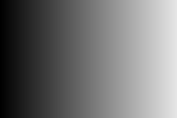

# 🐣 S1 | Prog: Workshop

# RAPPORT
20/22/2023

---

Template de projet pour le workshop de prog des Imac1. Vous trouverez le sujet ici: https://dsmte.github.io/Learn--cpp_programming/Workshop

<!-- [[_TOC_]]  --><!-- creer table des matiere -->

<!-- bouton pour revenir en haut -->

 
EXERCICES WORKSHOP

 

## EXERCICE 1  || Ne garder que le vert || ⭐

 
RESULTATS

 

<!-- redimensionner =150x -->

 
COMMENTAIRES 

Ce premier exercice n'était pas dur mais permettait de nous faire comprendre comment agir sur les couleurs rouge, vert, bleu d'un pixel indépendamment les unes des autres.

 
 

---
## EXERCICE 2  || Échanger les canaux || ⭐

 
RESULTATS

 

 
COMMENTAIRES 

__Elisabeth__

Pour réaliser cet exercice, j'ai choisi de créer une nouvelle variable afin de stocker une des deux couleurs à échanger pour que celle-ci ne soit pas modifiée lors du premier échange.

__Laurine__

Au départ, dans le but d'échanger les couleurs, j'ai fait l'erreur d'assigner le canal bleu au canal rouge puis le canal rouge au canal bleu. Mais je me suis rendue compte que cette methode écrasait le canal bleu. J'ai donc trouvé une autre facon de faire fonctionner le programme en utilisant la fonction swap.
 

---
## EXERCICE 3  || Noir & Blanc || ⭐

 
RESULTATS

 

 
COMMENTAIRES

 

__Elisabeth__
Je n'ai pas pensé immédiatemment à faire une moyenne des trois couleurs pour obtenir du gris mais une fois la formule trouvée, le code est simple à réaliser.
 

__Laurine__

J'ai eu du mal à trouver la formule permettant de transformer un pixel de couluer en nuance de gris. Mais une fois trouvé le code n'a pas été difficile à ecrire.

 
 

---
## EXERCICE 4  || Négatif || ⭐

<!-- [Remonter tout en haut](#🐣 s1 | prog: workshop)
###s1 -->

 
RESULTATS

 

 
COMMENTAIRES

 

__Elisabeth__

Comme pour  l'exercice précédent, la difficulté est de trouver la formule (1-couleur concernée du pixel), mais le code en lui même est rapide et simple à réaliser.
 

__Laurine__
Je n'ai pas rencontré de probleme particulier pour cet exercice.

 

---
## EXERCICE 5  || Dégradé || ⭐

 
RESULTATS

 

 

 
COMMENTAIRES

__Elisabeth__
Pour cet exercice, les couleurs rouge, vert et bleu de mon pixel sont les mêmes que celles du pixel précédent auquel j'ajoute 0.003. Ceci me permet d'obtenir un dégradé progressif du noir ver le blanc. Il faut bien penser à agir sur les trois couleurs pour obtenir du blanc et à réutiliser les valeurs du pixel précédent pour obtenir un dégradé progressif.  
 

__Laurine__

 

---
## EXERCICE 6  || Miroir || ⭐⭐

 
RESULTATS

 

 
COMMENTAIRES

__Elisabeth__

__Laurine__

---
## EXERCICE 7  || Image bruitée || ⭐⭐

 
RESULTATS

 

 
COMMENTAIRES

__Elisabeth__
 

__Laurine__

 

---
## EXERCICE 8  || Rotation de 90° || ⭐⭐

 
__Elisabeth__

 

 

 
__Laurine__

 

 

---
## EXERCICE 9    || RGB split || ⭐⭐

 
RESULTATS

 

 
COMMENTAIRES

J'avais d'abord évité cet exercice pour faire les suivants car il me semblait compliqué. Cependant, l'ayant finalement fait après avoir fini les exercices de niveau 3 et commencé ceux de niveau 4, il m'a paru très simple et je n'ai pas rencontré de difficultés. 
Le seul piège à éviter me semble être l'utilisation de la même image.

 

 
Laurine

 

 

---
## EXERCICE 10 || Luminosité || ⭐⭐

 
RESULTATS

 

 
COMMENTAIRES

__Elisabeth__

__Laurine__

---
## EXERCICE 11  || Disque || ⭐⭐

 
RESULTATS

 

 
COMMENTAIRES

__Elisabeth__

__Laurine__

---
## EXERCICE 12  || Cercle || ⭐

 
RESULTATS

 

 
COMMENTAIRES

__Elisabeth__

__Laurine__

---
## EXERCICE 13  || Rosace || ⭐⭐⭐

 
RESULTATS

 

 
COMMENTAIRES

__Elisabeth__

__Laurine__

---
## EXERCICE 14  || Mosaïque || ⭐⭐

 
RESULTATS

 

 
COMMENTAIRES

La difficulté de cette exercice est de trouver la formule du modulo, le reste est simple à réaliser.

---
## EXERCICE 15  || Mosaïque miroir || ⭐⭐⭐

 
RESULTATS

 

 
COMMENTAIRES

---
## EXERCICE 16  || Glitch || ⭐⭐⭐

 
RESULTATS

 

 
COMMENTAIRES

__Elisabeth__

__Laurine__
La difficulté sur cet exercice etait d'utiliser deux images en reflechissant comment ces dernières étaient liés entre elle.
Le positionnement des parties du logo a prendre nous a aussi posé beaucoup de problèmes car au départ nous prenions toujours la meme partie du logo, le carrée noir en haut a gauche. (voir image ci dessous) 
 

 
Dans cet exercice il fallait aussi faire tres attention à ne pas dépasser la taille de l'image d'origine. 
Ainsi qu'au dépassement de données. (en n'oubliant pas le "-1" lorsqu'on fait une boucle en fonction de la taille de l'image car on commence à 0)

---
## EXERCICE 17  || Fractale de Mandelbrot || ⭐⭐⭐

 
RESULTATS

 

 
COMMENTAIRES

Pour cette exercice, j'ai été beaucoup aidé car Colin m'a donné la formule de mon x_to_two et mon y_to_two pour passer de l'intervalle de la taille de mon image à l'intervalle [-2;2]. Cette formule m'a beaucoup facilité la réalisation du programme.

---
## EXERCICE 18  || Vortex || ⭐⭐⭐(⭐)

 
RESULTATS

 

 
COMMENTAIRES

La plus grosse difficulté pour moi fût de comprendre l'utilisation de la fonction rotated donnée. J'ai maintenant compris comment l'utiliser mais je ne comprends toujours pas bien son fonctionnement. De plus, je n'aurais sûrement pas pensé à utiliser la  distance sans les explications de Jules.

---
## EXERCICE 19  || Tramage || ⭐⭐⭐(⭐)

 
RESULTATS

![essai_tramage]

 

 
COMMENTAIRES

Notre plus grande difficulté ici a été de comprendre la logique du tramage, entre les croix, les points et le blanc et le noir.
Pour cet exercice nous ne sommes pas parvenue au résultat attendu.
Cependant nous avaons réussi la notion de probabilité pour choisir la couleur que doit prendre le pixel (noir ou blanc) en fonction de la nuance de couleur de l'image d'origine. 

---
## EXERCICE 20  || Normalisation de l'histogramme || ⭐⭐⭐(⭐)

---
## EXERCICE 21  || Convolutions || ⭐⭐⭐⭐

 
RESULTATS

 

 
COMMENTAIRES

La difficulté de cette exercice est de gérer les cas particuliers dans les coins et sur les bords. Mon programme ne s'occupe pas de ces pixels puisqu'il modifie la couleur de mes pixels à partir du (1,1) jusqu'au (299,344). De plus, mon programme ne permet pas de modifier le karnel simplement, il faut ajouter des pixels à mon tableau "trois_par_trois", puis à ma fonction "color" ainsi que changer l'indice du pixel qu'elle modifie et return.
J'ai rencontré des difficultés lors de cet exercice car je m'obstinais à vouloir stocker les pixels résultants de ma fonction "color" dans un nouveau tableau au lieu de les appliquer directement à mon image. Ceci m'a fait perdre beaucoup de temps car cela empechait mon programme de fonctionner en plus de le complexifier inutilement.

---
## EXERCICE 22  || Netteté, Contours, etc. || ⭐

 
RESULTATS

 

 
COMMENTAIRES

---
## EXERCICE 23  || Filtres séparables || ⭐⭐

---
## EXERCICE 24  || Différence gaussiennes || ⭐⭐

---
## EXERCICE 25  || Tri de pixels || ⭐⭐⭐⭐

 
RESULTATS

 

 
COMMENTAIRES

Contrairement à ce que je m'étais imaginé, créer une fonction permettant de trier les pixels par luminosité n'a pas été le plus dur. Pour moi, la difficulté s'est trouvée dans le déplacement des nouveaux minis rectangle triés au bon endroit dans l'image. Bien que leur position soit random, elle ne l'est pas autant que pour le glitch car le nouveau minirectangle reste a proximité du minirectangle d'origine.

 

 
EXERCICES SUPPLEMENTAIRES 

## EXERCICE OMBRE  || Ne garder que le vert || ⭐⭐⭐⭐

